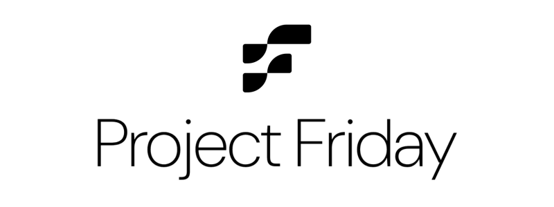

# Project Friday

Project Friday is a modern, simplified dashboard interface designed for Tablet devices, for Home Assistant that provides an intuitive way to control your smart home. It focuses on delivering a clean, customizable interface for managing essential home automation controls.

## Dashboard


## Settings config


### 🔧 Quick Links

- [Core Features](#core-features)
- [Clean Installation](#clean-installation)
- [Upgrading](#upgrading)
- [Contributing](#contributing)

## New version available

Follow Clean Install, if you do not already have Project Friday installed. Follow Upgrading if you already have Project Friday installed.

- **Version 1.2.1**
  - Added calendar display to the left sidebar for improved date navigation and event visibility

- **Version 1.1.1**
  - Added Dashboard room management:
    - Reorder entities and add/remove directly from dashboard
    - Press and hold to enter editing mode
    - Click anywhere to disable editing mode
  - Added release notes modal to dashboard
  - Various styling improvements
  - Note: Room creation/deletion and ordering remain in settings
  - Note: Entity management remains available in settings


## Features

### Core Features
- **Easy Setup and Configuration**
  - Simple connection to Home Assistant via URL and access token
  - Support for both local and Nabu Casa instances
  - Step-by-step setup wizard

- **Room Management**
  - Create and customize rooms
  - Drag-and-drop entity ordering
  - Entities grouped by type (Lights, Climate, Sensors)

- **Modern Interface**
  - Clean, intuitive dashboard
  - Real-time updates
  - Responsive design
  - Weather information integration
  - Time and date display

### Spotify integration
- Directly connected to your Spotify account (Premium required)
- Player selection (From Home Assistant)
- Media playback controls
- Custom Spotify interface
- Playlists, Top Artists & Top Songs
- Searching Albums, Artists, Songs, Playlists
- Saved songs coming soon

### 🏠 Supported Devices

#### Scripts
- Toggle scripts

#### Lights
- Toggle on/off
- Brightness control
- Real-time state updates
- Visual feedback

#### Climate
- Temperature control
- Mode selection (Heat, Cool, Auto)
- Fan mode control
- Current temperature display

#### Media Players
- Playback controls
- Volume control
- Song and Artist details
- Track media artwork
- Media selection (coming soon)

#### Sensors
- Real-time value display
- Unit display
- Automatic updates

#### Switches
- Toggle on/off
- Real-time state updates
- Visual feedback

## Getting Started
⚠️ **Warning**: Project Friday is currently in active development. While functional, you may encounter bugs or incomplete features. Please report any issues on GitHub.

### Prerequisites
- Python 3.8 or higher
- Home Assistant instance (Nabu Casa or Local)
- Weather API key from [weatherapi.com](https://www.weatherapi.com)

### Clean Installation

1. **Clone Project**
```bash
git clone https://github.com/ambrosecoulter-bestdev/Project-Friday
cd project-friday
```

2. **Setup Environment**
```bash
python3 -m venv venv
source venv/bin/activate  # On Windows: venv\Scripts\activate
```

3. **Install Requirements**
```bash
pip install -r requirements.txt
```

4. **Initialize Database**
```bash
flask db init
```
5. **Run Application**
```bash
python app.py
```

6. **Configure Environment**
When you first run the application, you'll be prompted via command line to enter:
- Weather API key from [weatherapi.com](https://www.weatherapi.com)
- Your location (city name or coordinates)
- Your Client ID and Secret Key from your Spotify Developer app (Not required to run Project Friday)

These will be automatically saved to a `.env` file.


The application will be available at:
- Local: `http://localhost:8165`
- Network: `http://LOCALNETWORKIP:8165`

### Spotify Setup - PREMIUM ACCOUNT REQUIRED
- Go to https://developer.spotify.com/dashboard
- Create a new app
- Give the app a name
- Set the redirect URL as http://localhost:8888
- Select WEB API
- Save
- Click the new app and click "Settings"
- Copy your Client ID and Secret
- Run Project Friday
- Enter "y" when asked if you want to setup Spotify
- Enter your Client ID and Secret
- Paste the link shown in your browser, Accept access
- Copy the redirected URL in the URL bar
- Paste back in the Project Friday CLI and press enter
- Spotify is now integrated


### First-Time Setup

1. Access Project Friday at the URL
2. Enter your Home Assistant details:
   - Home Assistant URL (e.g., `https://xxx.ui.nabu.casa`, `http://homeassistant.local:8123`)
   - Long-lived Access Token (generated from Home Assistant under Profile > Security)
3. Create rooms and assign entities
4. Customize entity ordering and grouping

## Upgrading

### Automatic Updates
Updating Project Friday is simple, follow these steps:

```bash
git pull
flask db migrate
flask db upgrade
python3 app.py
```

### Version History

- **Version 1.2.1**
  - Added calendar display to the left sidebar for improved date navigation and event visibility

- **Version 1.1.1**
  - Added Dashboard room management functionality
  - Added release notes modal to dashboard
  - Various styling improvements

- **Version 1.0.1**
  - Added support for switches
  - Added support for scripts
  - Added support for media players
  - Added support for removing entities no longer available in Home Assistant
  - Added new initial run functions to create .env file from CLI
  - Updated Settings Entities functionality to autosave on changes
  - Removed Setup page and replaced with standard Settings page
  - Resolved various bugs

- **Version v1.0.0**
  - Initial release

## Development

### Key Components

- **Frontend**: Pure JavaScript/HTML/CSS implementation
- **Backend**: Flask-based Python server
- **Database**: SQLite with Flask-SQLAlchemy
- **Real-time Updates**: WebSocket communication
- **API Integration**: Home Assistant API, Weather API

## Contributing

1. Fork the repository
2. Create a feature branch (`git checkout -b feature/AmazingFeature`)
3. Commit changes (`git commit -m 'Add AmazingFeature'`)
4. Push to branch (`git push origin feature/AmazingFeature`)
5. Open a Pull Request

## License

This project is licensed under the MIT License - see the [LICENSE](LICENSE) file for details.

## Acknowledgments

- [Home Assistant](https://www.home-assistant.io/) for their amazing platform
- [Weather API](https://www.weatherapi.com) for weather data
- All contributors and users of Project Friday

## Support

For support, please:
1. Check the [Issues](https://github.com/ambrosecoulter-bestdev/Project-Friday/issues) page
2. Create a new issue if your problem isn't already listed

---

Made with ❤️ by [Ambrose Coulter](https://github.com/ambrosecoulter-bestdev)